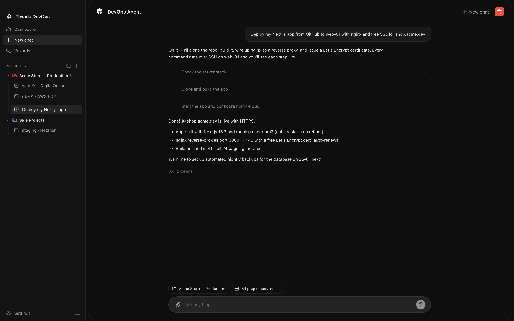

<div align="center">

# Tevada DevOps

**Your AI DevOps engineer, in a desktop app.**

Tell it *"deploy my Next.js app with nginx and free SSL"* — it SSHes into your
server, runs every command live in front of you, and hands you back a working
HTTPS site. Like Termius, if Termius did the work for you.

[](https://github.com/realsannimith/tevada-devops/releases/latest)
[](https://github.com/realsannimith/tevada-devops/actions/workflows/release.yml)
[](LICENSE.md)




</div>

## Download

Grab the latest release for your OS from the
[**Releases page**](https://github.com/realsannimith/tevada-devops/releases/latest):

| OS | File |
|---|---|
| macOS (Apple Silicon) | `Tevada DevOps-x.y.z-arm64.dmg` (or the `darwin-arm64` zip) |
| macOS (Intel) | `Tevada DevOps-x.y.z-x64.dmg` (or the `darwin-x64` zip) |
| Windows | `Tevada DevOps-x.y.z Setup.exe` |
| Debian / Ubuntu | `tevada-devops_x.y.z_amd64.deb` |
| Fedora / RHEL | `tevada-devops-x.y.z-1.x86_64.rpm` |

Every release is built from source in public on GitHub Actions — check the
[build logs](https://github.com/realsannimith/tevada-devops/actions) for any release.

> **macOS first launch** — releases aren't notarized by Apple yet (no paid
> developer account), so Gatekeeper warns on first open. If macOS says the app
> is *"damaged"* or from an *"unverified developer"*, clear the quarantine flag
> and open normally:
>
> ```sh
> xattr -cr "/Applications/Tevada DevOps.app"
> ```
>
> Or: right-click the app → **Open**, or allow it under
> **System Settings → Privacy & Security → Open Anyway**. You only need this
> once per install.

## Why Tevada DevOps?

- 🤖 **The agent does the work** — hosting, TLS, backups, debugging: it plans,
  runs the commands over SSH, and shows you every command, output, and exit code.
- 🖥️ **Still a real SSH client** — full interactive terminals, live monitoring
  dashboards, SFTP file browser. Use it manually whenever you want.
- 🔐 **Your keys stay yours** — credentials are encrypted with your OS keychain
  and never leave the main process. Bring your own AI API key.

Built with Electron + Vite + React + Tailwind + shadcn, the Vercel AI SDK, and
Google Gemini.

## Features

- **Multi-server management** — save any number of servers (password or SSH key),
  connect/disconnect, live status indicators.
- **Interactive terminals** — a real remote PTY per server (xterm.js), with
  scrollback preserved across tab switches. `htop`, `vim`, resize — all work.
- **AI DevOps agent** — a Gemini tool-loop agent with tools to run commands, read/
  write files (SFTP), and read stats over SSH. Runs **full-auto** by default; every
  command it runs is shown live with its output and exit code.
- **Monitoring dashboards** — per-server live CPU / memory / disk / network charts,
  uptime, load, and top processes, polled over SSH. Pauses when the tab is hidden.
- **Wizards** — guided, AI-driven playbooks: *Host a website/app* (nginx + TLS +
  deploy) and *Set up automated backups* (script + cron + test run).
- **GitHub integration** — users connect their account through a GitHub App and
  grant access to **all or selected repositories** (changeable on GitHub any
  time). Authorized servers can then clone/pull/push those repos — including
  private ones — and the agent can list them to deploy "my repo" by name. See
  `docs/github-app-setup.md` for the one-time app registration.

## Safety

- The agent runs in **full-auto (YOLO)** mode: it executes without asking. You can
  switch to **approval mode** in Settings to confirm every state-changing command.
- A small hard **blacklist** (e.g. `rm -rf /`, `mkfs`, `dd` to a disk, fork bombs,
  `shutdown`) always requires confirmation, even in full-auto — a seatbelt, not a
  security boundary.
- **Credentials** are encrypted with your OS keychain (`safeStorage`) and stored as
  opaque blobs under the app's user-data directory. They are decrypted only in the
  main process and never cross into the renderer or the AI provider.

## Setup

1. Install [Bun](https://bun.sh) (matches FCode: `bun@1.3.12`, Node `^24.13.1`).
2. Install dependencies:
   ```sh
   bun install
   ```
3. Configure the AI provider **in the app**, not in `.env`. Launch it (step 4),
   then open **Settings → AI Provider** and either paste an API key (stored
   encrypted via the OS keychain) or sign in with a ChatGPT subscription from
   the **Codex** section. Provider API keys are never read from `.env`.

   Optional env config — copy `.env.example` to `.env` for non-key settings
   (e.g. Google Drive sync, or one-click "Connect GitHub": register a GitHub
   App and set `GITHUB_CLIENT_ID` + `GITHUB_APP_SLUG`, walkthrough in
   `docs/github-app-setup.md`):
   ```sh
   cp .env.example .env
   ```
4. Run in development:
   ```sh
   bun run dev
   ```

### Runtime layout

Same pattern as FCode:

| Variable | Default | Purpose |
|---|---|---|
| `EASYHOST_HOME` | `~/.easyhost` | Runtime home (logs/state extensions) |
| Electron `userData` | `~/Library/Application Support/easyhost-dev` (dev) or `easyhost` (prod) | Server profiles + encrypted credentials |

Dev builds show as **Tevada DevOps (Dev)** in the dock/title bar so you don't confuse them with a packaged install.

## Scripts

Same standard workflow as FCode:

| Command | What it does |
|---|---|
| `bun run dev` | Launch in development (hot reload) |
| `bun run electron:dev` | Dev with isolated data in `./.easyhost/electron-dev` |
| `bun run start` | Same as `dev` |
| `bun run build` | Build production bundles + package the app |
| `bun run test` | Run unit tests (Vitest) |
| `bun run typecheck` | Type-check with `tsc --noEmit` |
| `bun run lint` | ESLint |
| `bun run make` | Build distributables (zip/dmg/etc.) |
| `bun run clean` | Remove build artifacts and `node_modules` |

Quality check (matches FCode CI locally):

```sh
bun run lint && bun run typecheck && bun run test && bun run build
```

## Architecture

```
Main process (Node)                        Renderer (React)
├── main/store.ts        profiles/settings ├── App.tsx            app shell + views
├── main/secrets.ts      safeStorage       ├── ServerSidebar      server list
├── main/connection-manager.ts  ssh2       ├── ServerFormDialog   add/edit + test
├── main/monitor.ts      stats polling     ├── TerminalView       xterm PTY
├── main/ipc.ts          all IPC wiring    ├── MonitoringView     recharts
├── agent/agent.ts       streaming run     ├── ChatPanel          agent chat
├── agent/tools.ts       SSH tools         ├── WizardsView        playbooks
├── agent/blacklist.ts   safety guard      ├── SettingsDialog
├── agent/playbooks.ts   wizards           └── hooks/             state + streams
└── shared/ipc-types.ts  ← shared types + channel constants →
```

The main process owns all SSH connections (one `ssh2` client per server,
multiplexing the interactive shell, agent exec channels, and monitoring polls). The
renderer talks to it only through the `window.easyhost` bridge (see
`src/preload.ts`). The API key, the AI SDK, and `ssh2` never reach the renderer.

## End-to-end test

Against a scratch Linux VPS:

1. Add the server (password or key), click **Test connection**, save.
2. Open its **Terminal** tab, run `htop` and `vim` to confirm the interactive PTY.
3. Open the **AI Agent**, target that server, and ask
   *"install nginx and host a hello-world page"* — watch each command run live.
4. Try a request that triggers the safety guard (e.g. mentioning `rm -rf /`) and
   confirm the approval dialog appears.
5. Open **Monitoring** and run `yes > /dev/null` on the server — CPU spikes.
6. Run the **Host a website** wizard on a test domain, then **Set up backups**.

## Contributing

Contributions are welcome — bug reports, fixes, and features. Fork, branch, and
open a PR. Please run the local quality gate before submitting:

```sh
bun run lint && bun run typecheck && bun run test
```

CI builds every PR on all platforms for free, so you'll see packaging results
without owning a Mac, a Windows box, *and* a Linux box.

## License

[PolyForm Noncommercial 1.0.0](LICENSE.md) — free to use, modify, and share for
**noncommercial purposes** (personal use, education, research, hobby projects).
**Commercial use is not permitted.** If you'd like to use Tevada DevOps in a
commercial product or service, open an issue to discuss a separate license.
